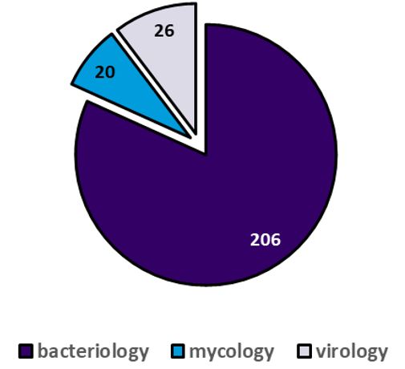

# ATCC Genome Portal – Q1 2026 Release Notes

**Release Date:** March 27, 2026

---

## At a Glance

- **252 new microbial genome pages released**
- **152 new Cell Biology datasets**
- **20 newly released bacteriophages, including highly novel genomes**
- **Expanded taxonomic diversity across bacteria, viruses, and fungi**
- **Platform and data pipeline enhancements**

---

## Data Releases

### Microbial Genomes

This release adds **252 new microbial genome pages** to the ATCC Genome Portal, expanding both taxonomic breadth and biological relevance across the collection. ATCC strives to release ~250 **NEW** genome/pages each quarter. The final number may fluctuate to account for any early-release genomes published as well as any pages that were taken down for futher curation.

**Release composition:**
- **82%** Bacteriology (206 Items)
- **10%** Virology (26 Items)
- **8%** Mycology (20 Items)

To see the detailed list of All new release microbial pages, please [Click Here](../AGP-assets/2026-Q1/2026-Q1-AGP-New-Genomes.xlsx)

**Highlights:**
- **144 unique genera** and **194 distinct species**
    - 80 Unique Families
- **27 genera newly introduced to the AGP**
    - Corallincola holothuriorum [**ATCC BAA-2611**](https://genomes.atcc.org/genomes/40a6a98f57444610)
    - Quadrisphaera granulorum [**ATCC BAA-1104**](https://genomes.atcc.org/genomes/7ce0b06cc8f24757)
    - Dolosicoccus paucivorans  [**ATCC BAA-56**](https://genomes.atcc.org/genomes/5be027a59ec94a4b)
    - Other new Genera releases to the AGP including:
        - Erythrobacter, Halobacteroides, Coriobacterium, Halochromatium, Filobacillus, Geminicoccus, Leptothrix, Papillibacter, Oceanimonas, Blastococcus, Rarobacter, Stappia, Celerinatantimonas, Facklamia, Frateuria, Planotetraspora, Saprospira.
- **20 bacteriophage genomes**, including multiple highly novel and unclassified phages with no close matches in public databases
    - 10 more genomes released for the ATCC 11303 historic modification collection.
    - [**ATCC 15261-B3**](https://genomes.atcc.org/genomes/361bfd3f854b4688) **Asticcacaulis excentricus bacteriophage Ac 24** 
        - low similarity to ANY phage genomes on NCBI!
- New and expanded representation of:
  - Gut microbiome organisms (human and animal)
    - [**ATCC 51870**](https://genomes.atcc.org/genomes/69df0fcde1014ee3) *Bifidobacterium longum*
    - [**ATCC TSD-277**](https://genomes.atcc.org/genomes/1c970d798c914797) *Allobaculum muciltyicum*
    - [**ATCC 25940**](https://genomes.atcc.org/genomes/8feb847e39dd471f) *Megasphaera elsdenii*
    - [**ATCC 35991**](https://genomes.atcc.org/genomes/09a49b05106547c6) *Eubacterium xyalnophilum*
    - [**ATCC 15218**](https://genomes.atcc.org/genomes/7c67f00a96684c12) *Vitroscilla stercoraria*
    - [**ATCC 700879**](https://genomes.atcc.org/genomes/b86399ed948e4197) *Papillibacter cinnamivorans*
    - [**ATCC 33741-B1**](https://genomes.atcc.org/genomes/31bb6495b0734768) *Peptoniphillus indolicus* 
    - [**ATCC 700683**](https://genomes.atcc.org/genomes/346739e5f9df47c1) *Cryptobacter curtum*
  - Spoilage‑associated and industrially relevant microbes
  - Clinically significant and multi‑drug‑resistant organisms

Several genomes released this quarter represent the most complete or highest‑quality assemblies currently available for their respective taxa.

---

### Cell Biology Data

Q1 2026 marks continued growth of Cell Biology data available through the Genome Portal.

- **88 new Cell Product Pages**
- **152 new dataset IDs**
  - **69 RNA‑seq datasets**
  - **83 Whole‑Exome Sequencing (WES) datasets**

These datasets increase coverage across human cell lines, organoids, and select animal models, with improved integration into portal navigation and downloads.

---

## 🧠 Platform & Pipeline Updates

### Assembly and Annotation Enhancements
- Expanded viral contig verification and strandedness checks
- Improved fungal rRNA prediction and inclusion in GenBank outputs
- Increased availability of antimicrobial resistance (AMR) annotations in bacterial genomes

### Data Products
- Expanded reporting of sequencing coverage metrics
- Improved metadata consistency across downloadable files
- Continued improvements to data provenance and auditability

---

## 🖥️ Portal & GUI Updates

- Improved navigation and visibility for Cell Biology data collections
- Preparatory updates supporting public release note access from the AGP documentation menu
- Incremental usability improvements across search and browsing workflows

---

## 🛠️ Fixes & Maintenance

- Corrected metadata display issues affecting a small number of genome pages
- Improved consistency of downloadable file naming in select cases
- General performance and stability improvements

---

## ℹ️ Notes

- Historical datasets may reflect legacy metadata or formatting conventions
- Ongoing enhancements will continue to standardize outputs across older and newly released data

---

For questions about this release or the ATCC Genome Portal, visit:
https://genomes.atcc.org
