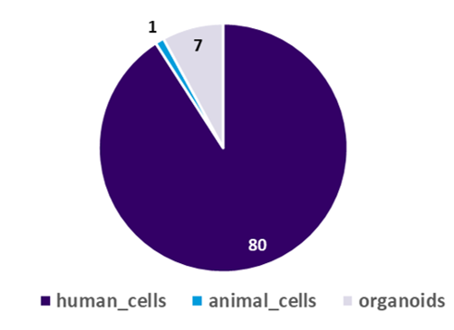

# ATCC Genome Portal – Q1 2026 Release Notes

**Release Date:** March 27, 2026

---

## At a Glance

- **252 new microbial genome pages released**
- **152 new Cell Biology datasets**
- **20 newly released bacteriophages, including highly novel genomes**
- **Expanded taxonomic diversity across bacteria, viruses, and fungi**
- **Platform and data pipeline enhancements**

---

# Data Releases

# Microbial Genomes

This release adds **252 new microbial genome pages** to the ATCC Genome Portal, expanding both taxonomic breadth and biological relevance across the collection. ATCC strives to release ~250 **NEW** genome/pages each quarter. The final number may fluctuate to account for any early-release genomes published as well as any pages that were taken down for futher curation.

### **Release composition:**
- **82%** Bacteriology (206 Items)
- **10%** Virology (26 Items)
- **8%** Mycology (20 Items)

To see the detailed list of All new release microbial pages, please [Click Here](../AGP-assets/2026-Q1/2026-Q1-AGP-New-Genomes.xlsx)

### **Highlights:**
- **144 unique genera** and **194 distinct species**
    - 80 Unique Families
- **27 genera newly introduced to the AGP**
    - Corallincola holothuriorum [**ATCC BAA-2611**](https://genomes.atcc.org/genomes/40a6a98f57444610)
    - Quadrisphaera granulorum [**ATCC BAA-1104**](https://genomes.atcc.org/genomes/7ce0b06cc8f24757)
    - Dolosicoccus paucivorans  [**ATCC BAA-56**](https://genomes.atcc.org/genomes/5be027a59ec94a4b)
    - Other new Genera releases to the AGP including:
        - Erythrobacter, Halobacteroides, Coriobacterium, Halochromatium, Filobacillus, Geminicoccus, Leptothrix, Papillibacter, Oceanimonas, Blastococcus, Rarobacter, Stappia, Celerinatantimonas, Facklamia, Frateuria, Planotetraspora, Saprospira.
 - #### **20 bacteriophage genomes**, including multiple highly novel and unclassified phages with no close matches in public databases
    - 10 more genomes released for the **ATCC 11303** historic modification collection.
    - [**ATCC 15261-B3**](https://genomes.atcc.org/genomes/361bfd3f854b4688) **Asticcacaulis excentricus bacteriophage Ac 24** 
      - low similarity to ANY phage genomes on NCBI!
- ### New and expanded representation of gut microbiome organisms (human and animal): 
  - [**ATCC 51870**](https://genomes.atcc.org/genomes/69df0fcde1014ee3) *Bifidobacterium longum*
  - [**ATCC TSD-277**](https://genomes.atcc.org/genomes/1c970d798c914797) *Allobaculum muciltyicum*
  - [**ATCC 25940**](https://genomes.atcc.org/genomes/8feb847e39dd471f) *Megasphaera elsdenii*
  - [**ATCC 35991**](https://genomes.atcc.org/genomes/09a49b05106547c6) *Eubacterium xyalnophilum*
  - [**ATCC 15218**](https://genomes.atcc.org/genomes/7c67f00a96684c12) *Vitroscilla stercoraria*
  - [**ATCC 700879**](https://genomes.atcc.org/genomes/b86399ed948e4197) *Papillibacter cinnamivorans*
  - [**ATCC 33741-B1**](https://genomes.atcc.org/genomes/31bb6495b0734768) *Peptoniphillus indolicus* 
  - [**ATCC 700683**](https://genomes.atcc.org/genomes/346739e5f9df47c1) *Cryptobacter curtum*
- ### Three clinically significant and multi‑drug‑resistant yeasts
  - [**ATCC MYA-5043**](https://genomes.atcc.org/genomes/c28b5ff853544f4d) *Candidozyma auris*
  - [**ATCC MYA-5044**](https://genomes.atcc.org/genomes/8a00f0dfa5e34d7e) *Candidozyma auris*
  - [**ATCC MYA-5046**](https://genomes.atcc.org/genomes/95a6ea415db94e8b) *Candidozyma auris*

- ### Completely novel genomes
  - [**ATCC MYA-5055**](https://genomes.atcc.org/genomes/18683f726eea4c08) *Filobasidium magnum*

- ### Understudied organisms and genomes (Only 1 Genome on NCBI)  
  "⭐" denotes AGP has greater or equal quality than NCBI public deposition
  - [**ATCC BAA-1364**](https://genomes.atcc.org/genomes/1a11ca8a670849b0) *Roseospira goensis*⭐
  - [**ATCC 35273**](https://genomes.atcc.org/genomes/b251066f4f9242c3) *Halobacteroides halobius*
  - [**ATCC 49490**](https://genomes.atcc.org/genomes/5f1be81823ca49cf) & [**ATCC 49491**](https://genomes.atcc.org/genomes/c402207fbec14364) *Trabulsiella guamensis*⭐
  - [**ATCC BAA-226**](https://genomes.atcc.org/genomes/96324d797e1a445c) *Ensifer arboris*⭐
  - [**ATCC 43525**](https://genomes.atcc.org/genomes/f51bf63af6274485) *Spiroplasma gladiatoris*⭐
  - [**ATCC 51606**](https://genomes.atcc.org/genomes/e9dc544cc6b94586) *Buttiauxella izardii*⭐
  - [**ATCC 33941**](https://genomes.atcc.org/genomes/a7b67f0aadc148c2) *Erythrobacter longus*⭐
  - [**ATCC 49209**](https://genomes.atcc.org/genomes/efcefbc3067043c7) *Coriobacterium glomerans*
  - [**ATCC 700202**](https://genomes.atcc.org/genomes/2e3db5514e48469b) *Halochromatium glycolicum*⭐
  - [**ATCC 700960**](https://genomes.atcc.org/genomes/150ded346fbf49f0) *Filobacillus milosensis*⭐
  - [**ATCC BAA-1365**](https://genomes.atcc.org/genomes/ac0546b96aa94dcc) *Roseospira visakhapatnamensis*⭐
  - [**ATCC BAA-1445**](https://genomes.atcc.org/genomes/489dadf5c0154f6d) *Geminicoccus roseus*

---

# Cell Biology Data

Q1 2026 marks the second bulk release of ATCC Authenticated Cell Biology data available through the Genome Portal.

### **88 new Cell Product Pages**  
  - 80 human cell lines
  - 7 organoid lines
  - 1 mouse cell line

  

### **152 new datasets**
  - **69 RNA‑seq datasets**
    - Normalized gene-level count files
  - **83 Whole‑Exome Sequencing (WES) datasets**
    - VCF with ClinVar annotated variants if applicable

These datasets are available to supporting members as well as end-users that have purchased physical vials of these cell-lines.   

To see the detailed list of All new release cell biology pages, please [Click Here](../AGP-assets/2026-Q1/2026-Q1-AGP-New-Cell-Lines.xlsx)

---

## 🛠️ Fixes & Maintenance

- [**ATCC VR-1966**](https://genomes.atcc.org/genomes/fe7df5ef2b37460e) *Mayaro Virus*
- [**ATCC MYA-4855**](https://genomes.atcc.org/genomes/7d5c13a311014066) *Pseudogymnoascus destructans*
- [**ATCC 4931**](https://genomes.atcc.org/genomes/69591a76d9ac441e) *Salmonella enteria subsp. enterica serovar Enteritidis*

---

## Additional Notes

- Ongoing enhancements in the next quarter will continue to standardize outputs across older and newly released data
- QOL improvements are underway for easier access and navigation in bulk downloads

---

For questions about this release or the ATCC Genome Portal, please utilize the following resources:
- https://genomes.atcc.org 
- https://www.atcc.org/applications/reference-quality-data/discover-the-atcc-genome-portal

or contact us at 
- nextgen@atcc.org
- https://www.atcc.org/support/contact-us
