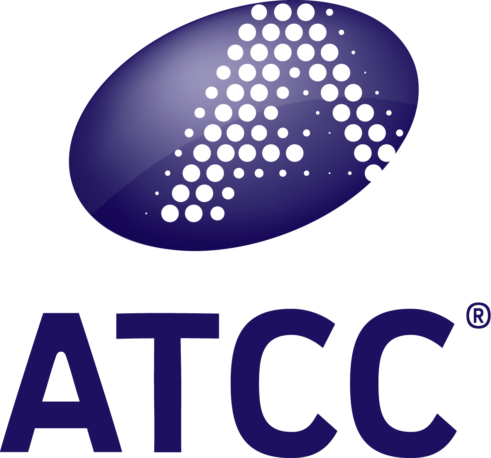

  
  

  
 

# ATCC Genome Portal – Release Notes

Welcome to the official release notes for the **ATCC Genome Portal (AGP)**.

Here you’ll find a quarterly summary of new data releases, platform enhancements, and updates to the portal and its underlying pipelines.

### [Learn more about the ATCC Genome Portal](https://www.atcc.org/applications/reference-quality-data/discover-the-atcc-genome-portal)
 
## Latest Release

### **Q1 2026 – March 27, 2026**
**252 new microbial genome pages**, **152 new Cell Biology datasets**, and expanded coverage across bacteria, viruses, fungi, and phages.

➡️ [**Q1 Release Notes**](AGP-releases/2026-Q1.md)

---

## Previous Releases

Pardon our dust while we populate previous releases 🧹

---

## ℹ️ About These Release Notes

Release notes are published quarterly and highlight:
- New genome and dataset releases
- Updates to any existing genomes or any taxonomic updates
- Platform, pipeline, and usability improvements
- Notable fixes and maintenance work aftecting previously available genomes / pages

---

Visit the Genome Portal:
https://genomes.atcc.org
